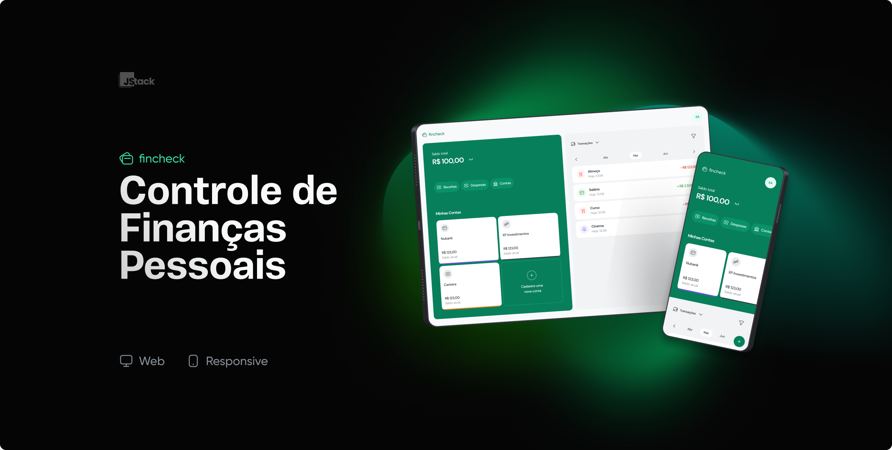

**Fincheck - Um aplicativo de controle financeiro.**  

   

## 💻 Sobre o projeto

Fincheck - Um aplicativo de controle financeiro.

Projeto desenvolvido durante um evento do curso Jstack

O JStack é um curso de Node.js, React, React Native e TypeScript focado em te preparar para o mercado e ensinar de verdade como essas tecnologias funcionam.

## 🛠 Tecnologias

As seguintes ferramentas foram usadas na construção do projeto:

> ## FRONTEND
- [Typescript]
- [React]
- [React Query]
- [React Hook Form]
- [Zod]
- [Tailwind CSS]

> ## BACKEND
-  [NestJs]
-  [Prisma]
-  [JWT]
-  [PostgreSQL]

